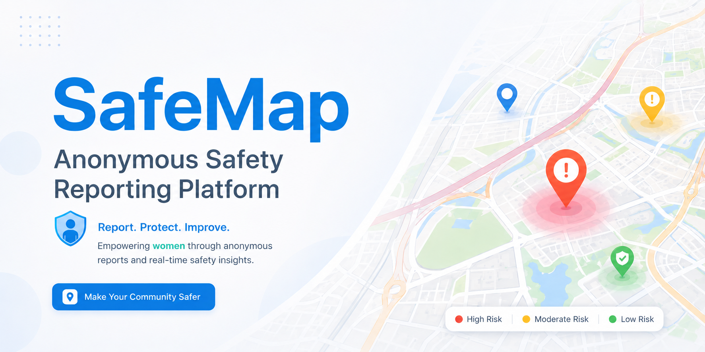
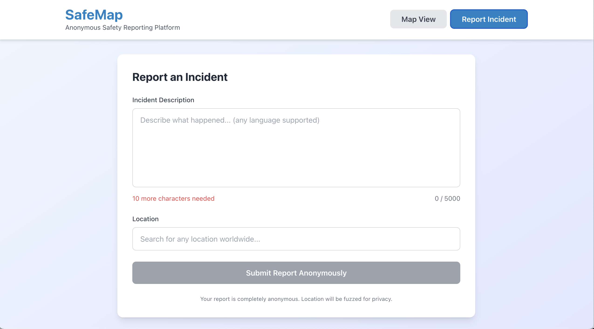
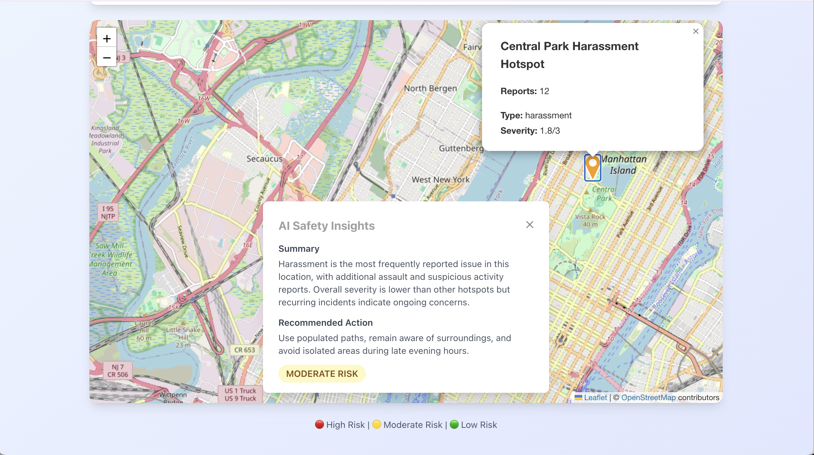

# 🗺️ SafeMap — Anonymous Community Safety Platform



[](https://fastapi.tiangolo.com)
[](https://react.dev)
[](https://ai.google.dev)
[](https://www.python.org)
[](https://www.typescriptlang.org)

SafeMap is an anonymous safety incident reporting platform for women that lets anyone flag a concern in plain language, in any language, and instantly sees it placed on a live community map — with no account, no tracking, and no raw text ever stored.

---

## Problem

Urban safety information is fragmented, slow, and frequently inaccessible. Official crime statistics are published weeks or months after incidents occur. Neighbourhood apps require accounts and personal data. Social media reports are unstructured and impossible to aggregate geographically.

> **The core problem is not a lack of concern — it is that people have no fast, private, zero-friction way to share and visualise safety information with their neighbours.**

**Why community safety reporting is difficult**

| Problem | Why it is difficult | SafeMap's response |
|---|---|---|
| Reporting deters privacy-conscious users | Most platforms require accounts or location history | Fully anonymous submission, no auth, no tracking |
| Incident language is unstructured | "Sketchy guy near the park at night" is not a database record | Gemini AI extracts type, severity, and time estimate |
| Location data reveals identity | Precise GPS coordinates can identify reporters | 50–100 m coordinate fuzzing applied before storage |
| Hotspots are invisible until too late | No live aggregated view exists for most communities | Real-time Leaflet map with severity-coded markers |

---

## Our Solution

SafeMap turns a free-text description and a map pin into a structured, anonymised, AI-parsed safety record — stored privately and surfaced as an actionable community hotspot.

Users describe what they saw in their own words and their own language. Gemini parses the natural language into a structured incident record. The backend fuzzes the coordinates and stores only the metadata — never the original text. Nearby incidents are aggregated into hotspots on an interactive map, and Gemini generates plain-language safety recommendations for each one.

> **SafeMap keeps the privacy guarantees absolute and uses AI only for interpretation. Raw text is never stored. Coordinates are always fuzzed. There is no way to trace a report back to its author.**

---

## AI & Technical Approach

SafeMap combines a privacy-first data pipeline with AI-powered natural language understanding. The anonymisation layer runs before any data is written to disk, while Gemini handles all interpretation of what was reported, where the risk clusters are, and what the community should know.

```
User submits free-text report + map pin
           │
           ▼
   FastAPI  POST /api/report
           │
           ├──▶  Gemini AI (geminiService.py)
           │         • Extracts incident_type
           │         • Extracts severity (low / moderate / high)
           │         • Estimates hour of occurrence
           │
           ├──▶  Privacy Utils (privacyUtils.py)
           │         • Applies 50–100 m random coordinate offset
           │         • Original text discarded — never stored
           │
           └──▶  SQLite via SQLAlchemy
                     • Stores: type, severity, hour, fuzzed lat/lng

Hotspot aggregation (GET /api/hotspots)
           │
           ▼
   HotspotService.py
           • Groups reports into 0.5 km grid cells
           • Calculates severity score and dominant incident type
           │
           └──▶  Gemini AI
                     • Generates actionable safety recommendations
                       per hotspot on demand
```

**Technical components**

| Layer | File(s) | Responsibility |
|---|---|---|
| API server | `app/main.py` | FastAPI routes, CORS, request validation |
| AI parsing | `app/services/geminiService.py` | NLP extraction and insight generation |
| Hotspot logic | `app/services/hotspotService.py` | Grid-based incident clustering |
| Privacy | `app/utils/privacyUtils.py` | Coordinate fuzzing before storage |
| ORM models | `app/models/dataModels.py` | SQLAlchemy Report table |
| Schemas | `app/models/apiSchemas.py` | Pydantic request/response types |
| Config | `app/config/appConfig.py` | Environment variable management |
| Database | `app/database/databaseConfig.py` | Engine and session factory |
| Map UI | `src/components/Map.tsx` | Leaflet hotspot visualisation |
| Report UI | `src/components/ReportForm.tsx` | Anonymous submission form |
| Location | `src/components/LocationSearch.tsx` | Nominatim-powered search |
| Stats UI | `src/components/StatsBar.tsx` | Live dashboard metrics |

---

## Features

| Feature | What it does |
|---|---|
| Anonymous incident reporting | Submit a free-text description with a map pin — no account required |
| Multilingual input | Gemini parses reports written in any language |
| AI-powered parsing | Extracts incident type, severity, and time estimate from natural language |
| Privacy-first storage | Raw text discarded; coordinates fuzzed 50–100 m before any write |
| Interactive hotspot map | Leaflet.js map with severity-coded markers (🔴 High · 🟡 Moderate · 🟢 Low) |
| AI safety insights | Gemini generates per-hotspot actionable recommendations on demand |
| Live dashboard | Total reports, active hotspots, most common incident type, peak hour |
| Location search | Nominatim / OpenStreetMap integration — no Google Maps API key needed |
| Demo Mode | Pre-loaded US city data for instant presentations with no API key |
| Mobile-first UI | Responsive TailwindCSS layout built for phones and tablets |
| Production-ready deploy | Vercel (frontend) + Render (backend) configs included |

### Anonymous Incident Reporting

<!-- 💡 IMAGE SUGGESTION: Screenshot of the ReportForm component —
     the text area with a sample description typed in, the location
     search field showing a result, and the Submit button.
     Save as docs/images/report-form.png -->
<!--  -->

- No account, email, or phone number required at any step.
- Accepts free text in any language — Gemini handles translation implicitly.
- Location chosen via map click or Nominatim search — not device GPS.
- Confirmation shown immediately; backend responds with the parsed record.

Example input → output:

```
Input:  "Late night robbery near the parking lot behind the station around 10pm"

Output: {
  "incident_type": "theft",
  "severity": "high",
  "hour_estimate": 22,
  "lat": 40.7134,       ← fuzzed from original pin
  "lng": -74.0063
}
```

### AI Safety Insights



- Click any hotspot marker to request a Gemini-generated insight.
- Insight includes a plain-language summary, recommended actions, and a risk level.
- Generated in real time from the aggregated report data for that cluster.
- In Demo Mode, insights are pre-generated so no API key is needed.

Example insight:

```
Summary:  "Multiple theft incidents reported during late evening hours
           near the transit hub. Peak activity between 9 PM and 11 PM."

Recommended action: "Avoid walking alone after dark in this area.
                     Use well-lit main roads and travel in groups
                     when possible. Report suspicious activity to
                     local authorities."

Risk level: high
```

### Interactive Hotspot Map

- Markers show clustered hotspots
- Click a marker to see report count, dominant incident type, severity score, and AI insight.
- Map auto-centres on active hotspots
- Tiles served by OpenStreetMap — no third-party map API key required.

### Demo Mode

Perfect for hackathon judging or showing the platform before any live reports exist.

| Feature | Live Mode | Demo Mode |
|---|---|---|
| Hotspots | Generated from database | Loaded from `hotspots.json` |
| AI Insights | Gemini API (real-time) | Loaded from `insights.json` |
| Stats | Computed from database | Computed from `incidents.json` |
| Submit Reports | ✅ Works | ✅ Works |
| Gemini API key | Required | Not required |
| Database | Required | Not required |

Enable with `USE_DUMMY_DATA=true` in `backend/.env`.

---

## Technology Stack

| Technology | Purpose | Key file(s) |
|---|---|---|
| React 18 + TypeScript | Frontend UI and components | `src/App.tsx`, `src/components/` |
| Vite | Fast frontend build and dev server | `vite.config.ts` |
| Bun | JavaScript runtime and package manager | `package.json` |
| TailwindCSS | Utility-first responsive styling | `tailwind.config.js` |
| Leaflet.js + React Leaflet | Interactive map rendering | `src/components/Map.tsx` |
| Axios | HTTP client for API calls | `src/services/api.ts` |
| FastAPI | REST API framework | `app/main.py` |
| Python 3.11+ | Backend language | `app/` |
| uv | Fast Python package manager | `pyproject.toml` |
| SQLite + SQLAlchemy | Data persistence | `app/database/databaseConfig.py` |
| Pydantic | Request/response schema validation | `app/models/apiSchemas.py` |
| Google Gemini | NLP parsing and AI insights | `app/services/geminiService.py` |
| Nominatim (OpenStreetMap) | Geocoding and location search | `src/services/nominatim.ts` |
| Vercel | Frontend CDN and edge hosting | `frontend/vercel.json` |
| Render | Backend cloud hosting | `backend/render.yaml` |

---

## Installation

For the fastest start, see **[SETUP.md](./SETUP.md)** — it covers both Demo Mode (no API key, up in 2 minutes) and Live Mode (full Gemini-powered setup).

**Quick start — Demo Mode**

```bash
git clone https://github.com/Invariants0/safemap.git
cd safemap

# Backend
cd backend && cp .env.example .env   # set USE_DUMMY_DATA=true
uv sync
uv run uvicorn app.main:app --reload --host 0.0.0.0 --port 8000

# Frontend (new terminal)
cd frontend && cp .env.example .env  # set VITE_API_URL=http://localhost:8000
bun install && bun run dev
```

Open `http://localhost:5173` — the map loads immediately with 7 US city hotspots. ✅

---

## API Reference

Full interactive docs available at `http://localhost:8000/docs` when the backend is running.

### `POST /api/report`

Submit an anonymous incident report.

```json
// Request
{ "text": "Suspicious activity near the station at 10 PM", "lat": 40.7128, "lng": -74.0060 }

// Response
{ "id": 1, "incident_type": "suspicious_activity", "severity": "moderate",
  "hour_estimate": 22, "lat": 40.7134, "lng": -74.0063, "created_at": "2026-06-04T22:00:00Z" }
```

### `GET /api/hotspots`

Returns all aggregated safety hotspots.

```json
[{ "id": "1", "name": "Theft Area (40.713, -74.006)", "lat": 40.713, "lng": -74.006,
   "report_count": 7, "dominant_incident": "theft", "severity_score": 2.6 }]
```

### `GET /api/hotspots/{id}/insight`

Returns a Gemini-generated safety insight for a specific hotspot.

```json
{ "summary": "Multiple theft incidents during late evening hours...",
  "recommended_action": "Avoid walking alone after 8 PM...",
  "risk_level": "high" }
```

### `GET /api/stats`

Returns live dashboard statistics.

```json
{ "total_reports": 42, "total_hotspots": 8, "most_common_incident": "theft", "peak_reporting_hour": 22 }
```

### `GET /health`

Health check.

```json
{ "status": "healthy", "service": "safemap-api" }
```

---

## Usage

1. Open the app and click **"Report Incident"**.
2. Type a description of what you saw — any language, any detail level.
3. Search for a location or click directly on the map.
4. Hit **Submit** — your report is parsed, anonymised, and stored.
5. Switch to **Map View** to see hotspot markers appear or update.
6. Click any marker to read the AI-generated safety insight for that area.
7. Check the **Stats Bar** at the top for community-wide numbers.

---

## Privacy & Security

SafeMap is built around the principle that safety reporting should never require a privacy trade-off.

- **No raw text stored** — original descriptions are processed by Gemini and then discarded.
- **Coordinate fuzzing** — a 50–100 m random offset is applied to every location before storage.
- **No authentication** — there are no accounts, sessions, or cookies.
- **Structured data only** — the database holds type, severity, hour estimate, and fuzzed coordinates.
- **Security headers** — `X-Content-Type-Options`, `X-Frame-Options`, and `X-XSS-Protection` set on all responses.
- **CORS** — configured to accept requests only from the registered frontend origin.

---

## Deployment

Full deployment instructions are in **[SETUP.md](./SETUP.md)**. In brief:

**Backend → Render**

Push to GitHub, connect the `backend/` directory on [render.com](https://render.com), and set these environment variables in the Render dashboard:

```
GEMINI_API_KEY=your_key
FRONTEND_URL=https://your-app.vercel.app
DATABASE_URL=sqlite:///./safemap.db
USE_DUMMY_DATA=false
```

**Frontend → Vercel**

Import the repo on [vercel.com](https://vercel.com), set root to `frontend/`, and add:

```
VITE_API_URL=https://your-backend.onrender.com
```

Vercel auto-detects Vite. Build command: `bun run build`. Output: `dist/`.

---

## Technical Highlights

| Metric | Detail |
|---|---|
| Privacy guarantee | Raw text never touches disk; coordinates offset 50–100 m |
| AI parsing latency | Gemini response typically under 2 seconds |
| Multilingual support | Any language accepted — no pre-processing required |
| Hotspot clustering | 0.5 km grid cells; designed for DBSCAN drop-in replacement |
| Demo data | 92 realistic incidents across 7 major US cities |
| Zero dependencies for demo | Full map + insights with `USE_DUMMY_DATA=true`, no API key |

---

## Roadmap

SafeMap is structured for richer AI analysis, broader deployment, and stronger community tooling.

### Short Term

- Add per-incident severity trend charts over time.
- Rate limiting on `POST /api/report` to prevent abuse.
- Unit and integration test coverage for backend services.

### Medium Term

- Multi-language UI (i18n) for the frontend.
- Heatmap overlay as an alternative to circle markers.
- Webhook or push notification support for area subscribers.
- Accessibility (WCAG 2.1) audit and remediation.

### Long Term

- Multi-city managed deployments with organisation-level dashboards.
- Community moderation layer for reported data quality.
- Integration with local government open data APIs.
- Native mobile app experience.

---

## Project Structure

```
SafeMap/
├── frontend/       # React 18 + TypeScript, Vite, TailwindCSS, Leaflet
├── backend/        # FastAPI, Python 3.11+, SQLite, Gemini AI
├── README.md       # This file
├── SETUP.md        # Full installation guide (Demo + Live mode)
├── ARCHITECTURE.md # Annotated directory tree and data-flow diagram
└── CONTRIBUTING.md # Branching, commit style, and contribution guide
```

See [ARCHITECTURE.md](./ARCHITECTURE.md) for the full annotated tree and ASCII data-flow diagram.

---

## Contributing

Contributions are welcome. See [CONTRIBUTING.md](./CONTRIBUTING.md) for setup, branching, commit conventions, and the list of areas we most need help with (DBSCAN clustering, tests, accessibility, i18n).

---
## License

This project is licensed under the MIT License. See [LICENSE](LICENSE) for details.

---

## Acknowledgments

- **Google** for the Gemini AI API.
- **OpenStreetMap & Nominatim** for free geocoding and map tiles.
- **Leaflet** for the open-source mapping library.
- **FastAPI** and **React** communities for excellent tooling and documentation.

---
<div align="center">

*Built with ❤️ by the SafeMap team*
<br>
*For every woman who's ever taken the long way home.*

</div>

